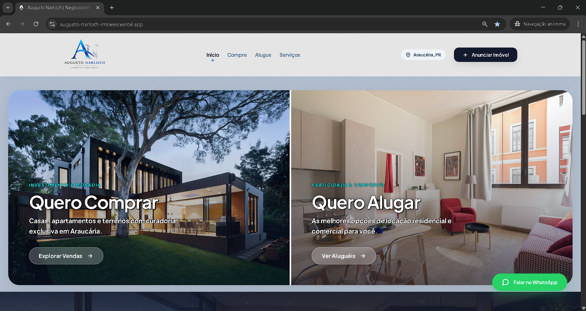
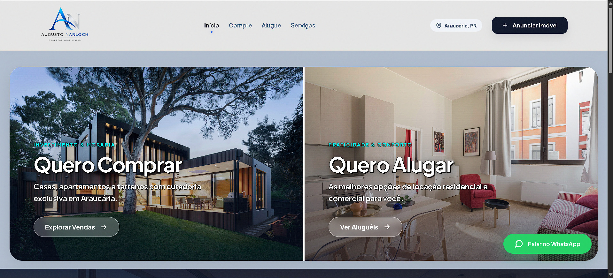
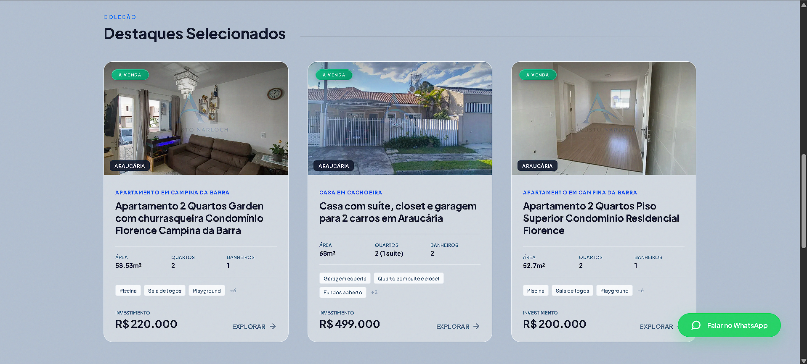

<div align="center">

# 🏢 Augusto Imóveis - Plataforma Imobiliária JAMStack

Plataforma imobiliária de alta performance desenvolvida com geração estática, gerenciamento de conteúdo headless e processamento de mídia dinâmico, focada em performance extrema e experiência do usuário.

<br>



<br>
<br>

## 🔗 Live Preview

**[Acesse o Site em Produção](https://augusto-narloch-imoveis.vercel.app/)**

<br>


</div>

---

## 🎯 Sobre o Projeto & Objetivos

Este projeto foi desenvolvido como uma plataforma completa para o mercado imobiliário, aliando uma interface de usuário moderna a uma arquitetura de back-end robusta.

O objetivo principal foi resolver desafios reais do setor: criar um catálogo de navegação ultrarrápida para clientes, facilitar a gestão de anúncios para os corretores através de um painel de controle (CMS) intuitivo e garantir a proteção autoral do material fotográfico de forma 100% automatizada.

---

## ✨ Funcionalidades e Engenharia (Key Features)

- **Arquitetura Headless:** Os imóveis, características e galerias são cadastrados no banco de dados do **Sanity CMS** e servidos via API (GROQ).
- **Processamento Dinâmico de Imagens (Cloudinary):**
  - Geração automática de miniaturas otimizadas para carregamento do mosaico.
  - Injeção dinâmica de **marca d'água responsiva (10% da largura relativa)** em imagens de alta resolução via URL (`fl_layer_apply,w_0.1,fl_relative`), protegendo os direitos autorais sem distorcer o layout no zoom.
- **Galeria Interativa (PhotoSwipe):** Extração de metadados originais (largura/altura) direto do banco de dados para evitar *cropping* indesejado na exibição expandida.
- **SSG (Static Site Generation):** Build pré-renderizado com **Astro**, garantindo velocidade extrema, navegação fluida e excelente pontuação no Core Web Vitals.
- **SEO Dinâmico:** Geração de Schema Markup (`RealEstateListing`) automático por imóvel.

---

## 📸 Interface do Projeto

### Homepage Desktop


---

### Homepage Mobile
<div align="center">

</div>

---

### Property Cards & Galeria


*(Para ver a galeria completa e o detalhamento interno, confira a aba de screenshots ou acesse o Live Preview).*

---

## 🛠️ Stack Tecnológico

- **[Astro](https://astro.build/)** - Framework SSG
- **[Sanity.io](https://www.sanity.io/)** - Headless CMS 
- **[Cloudinary](https://cloudinary.com/)** - CDN e manipulação de mídia On-the-Fly
- **[PhotoSwipe](https://photoswipe.com/)** - Lightbox engine
- **HTML5 & CSS3** - Estruturação e estilização customizada
- **Vercel** - Hospedagem e CI/CD

---

## 📂 Estrutura do Código

A arquitetura do projeto separa claramente a interface da lógica de consumo de dados:

```text
/
├── public/                 # Assets estáticos 
├── src/
│   ├── components/         # Componentes isolados (Cards, Header, Mosaico)
│   ├── lib/
│   │   ├── cloudinary.js   # Engenharia de injeção de camadas na CDN
│   │   └── queries.js      # Consultas GROQ para requisição no Sanity
│   ├── pages/
│   │   ├── [slug].astro    # Rotas dinâmicas de renderização dos imóveis
│   │   └── index.astro     # Home page e catálogo
└── package.json